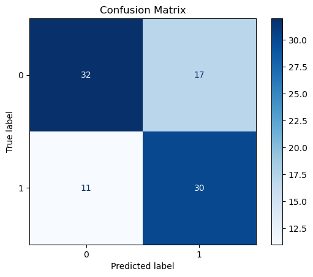
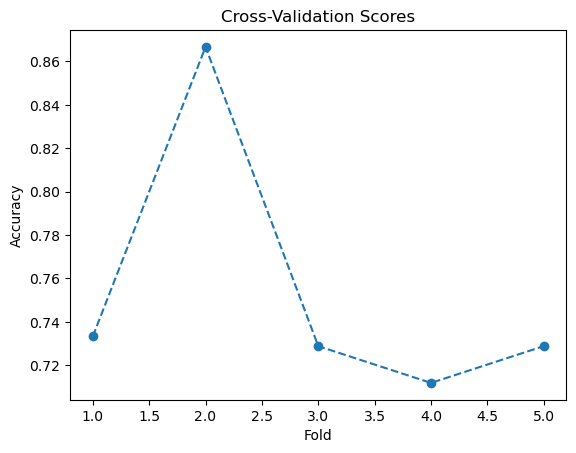
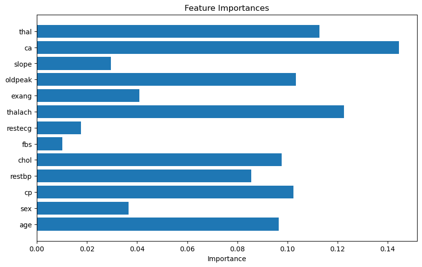
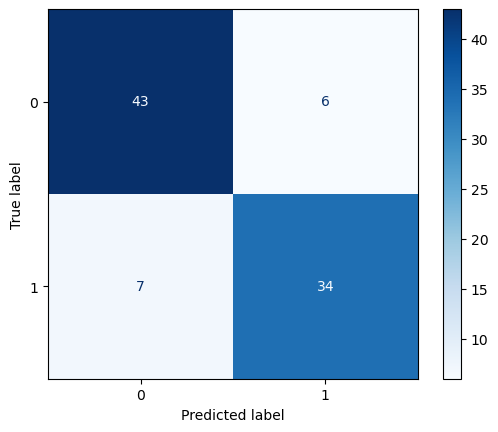
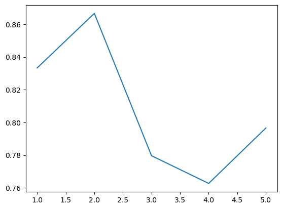

```python
import numpy as np
import pandas as pd
from sklearn.model_selection import train_test_split, cross_val_score, GridSearchCV
from sklearn.tree import DecisionTreeClassifier
from sklearn.metrics import confusion_matrix, ConfusionMatrixDisplay, accuracy_score, precision_score, classification_report
import matplotlib.pyplot as plt

# Load the dataset
data = pd.read_csv("/home/anaswara/Downloads/Heart_Disease .csv")


# Cleaning the dataset
data = data.loc[(data['ca'] != '?') & (data['thal']!= '?')]


# Split data into features (X) and target (y)
X = data.drop(columns=['Diseased'])  # All features
y = data['Diseased']                # Target column

# Split the data into training and testing sets
X_train, X_test, y_train, y_test = train_test_split(X, y, test_size=0.3, random_state=42)

# 2. Build a Decision Tree classifier using Gini index
clf = DecisionTreeClassifier(criterion='gini', random_state=42)
clf.fit(X_train, y_train)

# 3. Compute and plot the confusion matrix
y_pred = clf.predict(X_test)
cm = confusion_matrix(y_test, y_pred)

# Use ConfusionMatrixDisplay to plot
disp = ConfusionMatrixDisplay(confusion_matrix=cm)
disp.plot(cmap='Blues')
plt.title("Confusion Matrix")
plt.show()

# 4. Find the cross-validation score and plot it
cv_scores = cross_val_score(clf, X, y, cv=5)

# Plot cross-validation scores
plt.plot(range(1, 6), cv_scores, marker='o', linestyle='--')
plt.title('Cross-Validation Scores')
plt.xlabel('Fold')
plt.ylabel('Accuracy')
plt.show()

# Output the cross-validation scores
print("Cross-validation scores:", cv_scores)
print("Mean cross-validation score:", np.mean(cv_scores))


accuracy = accuracy_score(y_test, y_pred)
precision = precision_score(y_test, y_pred)
print(f'Accuracy : {accuracy : .4f}')
print(f'Precision : {precision : .4f}')


from sklearn.ensemble import RandomForestClassifier
rf=RandomForestClassifier(n_estimators=100, random_state=42)
rf.fit(X_train,y_train)

# print(rf.feature_importances_)
feature_importances = rf.feature_importances_
print("Feature Importances:")
for feature, importance in zip(X.columns, feature_importances):
    print(f"{feature}: {importance:.4f}")

plt.figure(figsize=(10, 6))
plt.barh(X.columns, feature_importances)
plt.title('Feature Importances')
plt.xlabel('Importance')
plt.show()


# from sklearn.metrics import confusion_matrix,ConfusionMatrixDisplay,accuracy_score
ypred=rf.predict(X_test)
cm=confusion_matrix(y_test,ypred)
# import matplotlib.pyplot as plt
disp=ConfusionMatrixDisplay(confusion_matrix=cm)
disp.plot(cmap='Blues')
plt.show()

cvs=cross_val_score(rf,X,y,cv=5)
plt.plot(range(1,6),cvs)
plt.show()

print(accuracy_score(y_test,ypred))


print("Classification Report:")
print(classification_report(y_test, ypred))


param_grid = {
    'n_estimators': [10, 50, 100, 200, 500],
    'max_depth': [None, 10, 20, 30],
    'max_features': ['auto', 'sqrt', 'log2']
}


# Initialize the GridSearchCV object
grid_search = GridSearchCV(estimator=rf, param_grid=param_grid, cv=5, n_jobs=-1, verbose=2)
grid_search.fit(X_train, y_train)

# Display the best parameters from the grid search
print("Optimal Parameters:")
print(grid_search.best_params_)

# (a) Optimal number of trees: grid_search.best_params_['n_estimators']
# (b) Optimal maximum depth: grid_search.best_params_['max_depth']
# (c) Optimal number of features: grid_search.best_params_['max_features']

# Print final evaluation metrics after tuning
best_rf_clf = grid_search.best_estimator_
Y_pred_best_rf = best_rf_clf.predict(X_test)
print("Classification Report after Hyperparameter Tuning:")
print(classification_report(y_test, Y_pred_best_rf))
```


    

    


    

    


    Cross-validation scores: [0.73333333 0.86666667 0.72881356 0.71186441 0.72881356]
    Mean cross-validation score: 0.7538983050847456
    Accuracy :  0.6889
    Precision :  0.6383
    Feature Importances:
    age: 0.0966
    sex: 0.0366
    cp: 0.1023
    restbp: 0.0855
    chol: 0.0976
    fbs: 0.0103
    restecg: 0.0177
    thalach: 0.1226
    exang: 0.0409
    oldpeak: 0.1033
    slope: 0.0295
    ca: 0.1445
    thal: 0.1127


    

    


    

    


    

    


    0.8555555555555555
    Classification Report:
                  precision    recall  f1-score   support
    
               0       0.86      0.88      0.87        49
               1       0.85      0.83      0.84        41
    
        accuracy                           0.86        90
       macro avg       0.85      0.85      0.85        90
    weighted avg       0.86      0.86      0.86        90
    
    Fitting 5 folds for each of 60 candidates, totalling 300 fits


    /home/anaswara/anaconda3/lib/python3.12/site-packages/sklearn/model_selection/_validation.py:547: FitFailedWarning: 
    100 fits failed out of a total of 300.
    The score on these train-test partitions for these parameters will be set to nan.
    If these failures are not expected, you can try to debug them by setting error_score='raise'.
    
    Below are more details about the failures:
    --------------------------------------------------------------------------------
    42 fits failed with the following error:
    Traceback (most recent call last):
      File "/home/anaswara/anaconda3/lib/python3.12/site-packages/sklearn/model_selection/_validation.py", line 895, in _fit_and_score
        estimator.fit(X_train, y_train, **fit_params)
      File "/home/anaswara/anaconda3/lib/python3.12/site-packages/sklearn/base.py", line 1467, in wrapper
        estimator._validate_params()
      File "/home/anaswara/anaconda3/lib/python3.12/site-packages/sklearn/base.py", line 666, in _validate_params
        validate_parameter_constraints(
      File "/home/anaswara/anaconda3/lib/python3.12/site-packages/sklearn/utils/_param_validation.py", line 95, in validate_parameter_constraints
        raise InvalidParameterError(
    sklearn.utils._param_validation.InvalidParameterError: The 'max_features' parameter of RandomForestClassifier must be an int in the range [1, inf), a float in the range (0.0, 1.0], a str among {'sqrt', 'log2'} or None. Got 'auto' instead.
    
    --------------------------------------------------------------------------------
    58 fits failed with the following error:
    Traceback (most recent call last):
      File "/home/anaswara/anaconda3/lib/python3.12/site-packages/sklearn/model_selection/_validation.py", line 895, in _fit_and_score
        estimator.fit(X_train, y_train, **fit_params)
      File "/home/anaswara/anaconda3/lib/python3.12/site-packages/sklearn/base.py", line 1467, in wrapper
        estimator._validate_params()
      File "/home/anaswara/anaconda3/lib/python3.12/site-packages/sklearn/base.py", line 666, in _validate_params
        validate_parameter_constraints(
      File "/home/anaswara/anaconda3/lib/python3.12/site-packages/sklearn/utils/_param_validation.py", line 95, in validate_parameter_constraints
        raise InvalidParameterError(
    sklearn.utils._param_validation.InvalidParameterError: The 'max_features' parameter of RandomForestClassifier must be an int in the range [1, inf), a float in the range (0.0, 1.0], a str among {'log2', 'sqrt'} or None. Got 'auto' instead.
    
      warnings.warn(some_fits_failed_message, FitFailedWarning)
    /home/anaswara/anaconda3/lib/python3.12/site-packages/sklearn/model_selection/_search.py:1051: UserWarning: One or more of the test scores are non-finite: [       nan        nan        nan        nan        nan 0.78222997
     0.79686411 0.79210221 0.79221835 0.78745645 0.78222997 0.79686411
     0.79210221 0.79221835 0.78745645        nan        nan        nan
            nan        nan 0.78710801 0.79686411 0.78246225 0.7873403
     0.7970964  0.78710801 0.79686411 0.78246225 0.7873403  0.7970964
            nan        nan        nan        nan        nan 0.78222997
     0.79686411 0.79210221 0.79221835 0.78745645 0.78222997 0.79686411
     0.79210221 0.79221835 0.78745645        nan        nan        nan
            nan        nan 0.78222997 0.79686411 0.79210221 0.79221835
     0.78745645 0.78222997 0.79686411 0.79210221 0.79221835 0.78745645]
      warnings.warn(


    Optimal Parameters:
    {'max_depth': 10, 'max_features': 'sqrt', 'n_estimators': 500}
    Classification Report after Hyperparameter Tuning:
                  precision    recall  f1-score   support
    
               0       0.84      0.88      0.86        49
               1       0.85      0.80      0.82        41
    
        accuracy                           0.84        90
       macro avg       0.84      0.84      0.84        90
    weighted avg       0.84      0.84      0.84        90
    


```python

```
