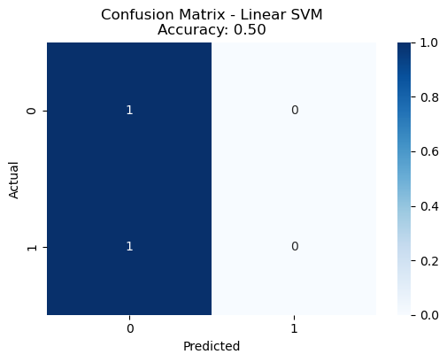
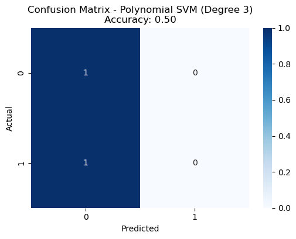

```python
import pandas as pd
from sklearn.model_selection import train_test_split
from sklearn.preprocessing import StandardScaler
from sklearn.svm import SVC
from sklearn.metrics import accuracy_score, confusion_matrix
import seaborn as sns
import matplotlib.pyplot as plt
```


```python
data = pd.read_csv('/home/anaswara/Downloads/archive (3)/spambase.csv')
```


```python
display(data)
```


<div>
<style scoped>
    .dataframe tbody tr th:only-of-type {
        vertical-align: middle;
    }

    .dataframe tbody tr th {
        vertical-align: top;
    }

    .dataframe thead th {
        text-align: right;
    }
</style>
<table border="1" class="dataframe">
  <thead>
    <tr style="text-align: right;">
      <th></th>
      <th>word_freq_make</th>
      <th>word_freq_address</th>
      <th>word_freq_all</th>
      <th>word_freq_3d</th>
      <th>word_freq_our</th>
      <th>word_freq_over</th>
      <th>word_freq_remove</th>
      <th>word_freq_internet</th>
      <th>word_freq_order</th>
      <th>word_freq_mail</th>
      <th>...</th>
      <th>char_freq_;</th>
      <th>char_freq_(</th>
      <th>char_freq_[</th>
      <th>char_freq_!</th>
      <th>char_freq_$</th>
      <th>char_freq_#</th>
      <th>capital_run_length_average</th>
      <th>capital_run_length_longest</th>
      <th>capital_run_length_total</th>
      <th>spam</th>
    </tr>
  </thead>
  <tbody>
    <tr>
      <th>0</th>
      <td>0.00</td>
      <td>0.64</td>
      <td>0.64</td>
      <td>0.0</td>
      <td>0.32</td>
      <td>0.00</td>
      <td>0.00</td>
      <td>0.00</td>
      <td>0.00</td>
      <td>0.00</td>
      <td>...</td>
      <td>0.000</td>
      <td>0.000</td>
      <td>0.0</td>
      <td>0.778</td>
      <td>0.000</td>
      <td>0.000</td>
      <td>3.756</td>
      <td>61</td>
      <td>278</td>
      <td>1</td>
    </tr>
    <tr>
      <th>1</th>
      <td>0.21</td>
      <td>0.28</td>
      <td>0.50</td>
      <td>0.0</td>
      <td>0.14</td>
      <td>0.28</td>
      <td>0.21</td>
      <td>0.07</td>
      <td>0.00</td>
      <td>0.94</td>
      <td>...</td>
      <td>0.000</td>
      <td>0.132</td>
      <td>0.0</td>
      <td>0.372</td>
      <td>0.180</td>
      <td>0.048</td>
      <td>5.114</td>
      <td>101</td>
      <td>1028</td>
      <td>1</td>
    </tr>
    <tr>
      <th>2</th>
      <td>0.06</td>
      <td>0.00</td>
      <td>0.71</td>
      <td>0.0</td>
      <td>1.23</td>
      <td>0.19</td>
      <td>0.19</td>
      <td>0.12</td>
      <td>0.64</td>
      <td>0.25</td>
      <td>...</td>
      <td>0.010</td>
      <td>0.143</td>
      <td>0.0</td>
      <td>0.276</td>
      <td>0.184</td>
      <td>0.010</td>
      <td>9.821</td>
      <td>485</td>
      <td>2259</td>
      <td>1</td>
    </tr>
    <tr>
      <th>3</th>
      <td>0.00</td>
      <td>0.00</td>
      <td>0.00</td>
      <td>0.0</td>
      <td>0.63</td>
      <td>0.00</td>
      <td>0.31</td>
      <td>0.63</td>
      <td>0.31</td>
      <td>0.63</td>
      <td>...</td>
      <td>0.000</td>
      <td>0.137</td>
      <td>0.0</td>
      <td>0.137</td>
      <td>0.000</td>
      <td>0.000</td>
      <td>3.537</td>
      <td>40</td>
      <td>191</td>
      <td>1</td>
    </tr>
    <tr>
      <th>4</th>
      <td>0.00</td>
      <td>0.00</td>
      <td>0.00</td>
      <td>0.0</td>
      <td>0.63</td>
      <td>0.00</td>
      <td>0.31</td>
      <td>0.63</td>
      <td>0.31</td>
      <td>0.63</td>
      <td>...</td>
      <td>0.000</td>
      <td>0.135</td>
      <td>0.0</td>
      <td>0.135</td>
      <td>0.000</td>
      <td>0.000</td>
      <td>3.537</td>
      <td>40</td>
      <td>191</td>
      <td>1</td>
    </tr>
    <tr>
      <th>...</th>
      <td>...</td>
      <td>...</td>
      <td>...</td>
      <td>...</td>
      <td>...</td>
      <td>...</td>
      <td>...</td>
      <td>...</td>
      <td>...</td>
      <td>...</td>
      <td>...</td>
      <td>...</td>
      <td>...</td>
      <td>...</td>
      <td>...</td>
      <td>...</td>
      <td>...</td>
      <td>...</td>
      <td>...</td>
      <td>...</td>
      <td>...</td>
    </tr>
    <tr>
      <th>4596</th>
      <td>0.31</td>
      <td>0.00</td>
      <td>0.62</td>
      <td>0.0</td>
      <td>0.00</td>
      <td>0.31</td>
      <td>0.00</td>
      <td>0.00</td>
      <td>0.00</td>
      <td>0.00</td>
      <td>...</td>
      <td>0.000</td>
      <td>0.232</td>
      <td>0.0</td>
      <td>0.000</td>
      <td>0.000</td>
      <td>0.000</td>
      <td>1.142</td>
      <td>3</td>
      <td>88</td>
      <td>0</td>
    </tr>
    <tr>
      <th>4597</th>
      <td>0.00</td>
      <td>0.00</td>
      <td>0.00</td>
      <td>0.0</td>
      <td>0.00</td>
      <td>0.00</td>
      <td>0.00</td>
      <td>0.00</td>
      <td>0.00</td>
      <td>0.00</td>
      <td>...</td>
      <td>0.000</td>
      <td>0.000</td>
      <td>0.0</td>
      <td>0.353</td>
      <td>0.000</td>
      <td>0.000</td>
      <td>1.555</td>
      <td>4</td>
      <td>14</td>
      <td>0</td>
    </tr>
    <tr>
      <th>4598</th>
      <td>0.30</td>
      <td>0.00</td>
      <td>0.30</td>
      <td>0.0</td>
      <td>0.00</td>
      <td>0.00</td>
      <td>0.00</td>
      <td>0.00</td>
      <td>0.00</td>
      <td>0.00</td>
      <td>...</td>
      <td>0.102</td>
      <td>0.718</td>
      <td>0.0</td>
      <td>0.000</td>
      <td>0.000</td>
      <td>0.000</td>
      <td>1.404</td>
      <td>6</td>
      <td>118</td>
      <td>0</td>
    </tr>
    <tr>
      <th>4599</th>
      <td>0.96</td>
      <td>0.00</td>
      <td>0.00</td>
      <td>0.0</td>
      <td>0.32</td>
      <td>0.00</td>
      <td>0.00</td>
      <td>0.00</td>
      <td>0.00</td>
      <td>0.00</td>
      <td>...</td>
      <td>0.000</td>
      <td>0.057</td>
      <td>0.0</td>
      <td>0.000</td>
      <td>0.000</td>
      <td>0.000</td>
      <td>1.147</td>
      <td>5</td>
      <td>78</td>
      <td>0</td>
    </tr>
    <tr>
      <th>4600</th>
      <td>0.00</td>
      <td>0.00</td>
      <td>0.65</td>
      <td>0.0</td>
      <td>0.00</td>
      <td>0.00</td>
      <td>0.00</td>
      <td>0.00</td>
      <td>0.00</td>
      <td>0.00</td>
      <td>...</td>
      <td>0.000</td>
      <td>0.000</td>
      <td>0.0</td>
      <td>0.125</td>
      <td>0.000</td>
      <td>0.000</td>
      <td>1.250</td>
      <td>5</td>
      <td>40</td>
      <td>0</td>
    </tr>
  </tbody>
</table>
<p>4601 rows × 58 columns</p>
</div>


```python
data = pd.DataFrame({
    'feature1': [0.1, 0.2, 0.3, 0.4, 0.5],
    'feature2': [0.4, 0.5, 0.1, 0.7, 0.3],
    'feature3': [0.3, 0.6, 0.2, 0.8, 0.1],
    'spam': [0, 1, 0, 1, 0]
})
```


```python
X = data.drop(columns='spam')
y = data['spam']
```


```python
display(data)
```


<div>
<style scoped>
    .dataframe tbody tr th:only-of-type {
        vertical-align: middle;
    }

    .dataframe tbody tr th {
        vertical-align: top;
    }

    .dataframe thead th {
        text-align: right;
    }
</style>
<table border="1" class="dataframe">
  <thead>
    <tr style="text-align: right;">
      <th></th>
      <th>feature1</th>
      <th>feature2</th>
      <th>feature3</th>
      <th>spam</th>
    </tr>
  </thead>
  <tbody>
    <tr>
      <th>0</th>
      <td>0.1</td>
      <td>0.4</td>
      <td>0.3</td>
      <td>0</td>
    </tr>
    <tr>
      <th>1</th>
      <td>0.2</td>
      <td>0.5</td>
      <td>0.6</td>
      <td>1</td>
    </tr>
    <tr>
      <th>2</th>
      <td>0.3</td>
      <td>0.1</td>
      <td>0.2</td>
      <td>0</td>
    </tr>
    <tr>
      <th>3</th>
      <td>0.4</td>
      <td>0.7</td>
      <td>0.8</td>
      <td>1</td>
    </tr>
    <tr>
      <th>4</th>
      <td>0.5</td>
      <td>0.3</td>
      <td>0.1</td>
      <td>0</td>
    </tr>
  </tbody>
</table>
</div>


```python
X_train, X_test, y_train, y_test = train_test_split(X, y,test_size=0.3, random_state=42)
```


```python
scaler = StandardScaler()
X_train_scaled = scaler.fit_transform(X_train)
X_test_scaled = scaler.transform(X_test)
```


```python
def plot_confusion_matrix(y_true, y_pred, model_name):
    conf_matrix = confusion_matrix(y_true, y_pred)
    plt.figure(figsize=(6, 4))
    sns.heatmap(conf_matrix, annot=True, fmt='d', cmap='Blues')
    plt.title(f"Confusion Matrix - {model_name}")
    plt.ylabel('Actual')
    plt.xlabel('Predicted')
    plt.show()
```


```python
linear_svm = SVC(kernel='linear', random_state=42)
linear_svm.fit(X_train_scaled, y_train)
y_pred_linear = linear_svm.predict(X_test_scaled)
accuracy_linear = accuracy_score(y_test, y_pred_linear)
plot_confusion_matrix(y_test, y_pred_linear, f"Linear SVM\nAccuracy: {accuracy_linear:.2f}")
```


    

    


```python
rbf_svm = SVC(kernel='rbf', random_state=42)
rbf_svm.fit(X_train_scaled, y_train)
y_pred_rbf = rbf_svm.predict(X_test_scaled)
accuracy_rbf = accuracy_score(y_test, y_pred_rbf)
plot_confusion_matrix(y_test, y_pred_rbf, f"Gaussian (RBF) SVM\nAccuracy: {accuracy_rbf:.2f}")
```


    

    


```python
poly_svm = SVC(kernel='poly', degree=3, random_state=42)
poly_svm.fit(X_train_scaled, y_train)
y_pred_poly = poly_svm.predict(X_test_scaled)
accuracy_poly = accuracy_score(y_test, y_pred_poly)
plot_confusion_matrix(y_test, y_pred_poly, f"Polynomial SVM (Degree 3)\nAccuracy: {accuracy_poly:.2f}")

```


    

    


```python
print(f"Linear SVM Accuracy: {accuracy_linear:.2f}")
print(f"Gaussian (RBF) SVM Accuracy: {accuracy_rbf:.2f}")
print(f"Polynomial SVM (Degree 3) Accuracy: {accuracy_poly:.2f}")

```

    Linear SVM Accuracy: 0.50
    Gaussian (RBF) SVM Accuracy: 0.50
    Polynomial SVM (Degree 3) Accuracy: 0.50


```python
accuracies = {
    'Linear SVM': accuracy_linear,
    'Gaussian RBF SVM': accuracy_rbf,
    'Polynomial SVM (Degree 3)': accuracy_poly
}
```


```python
best_model = max(accuracies, key=accuracies.get)
print(f"\nThe best performing model is: {best_model} with an accuracy of {accuracies[best_model]:.2f}")
```

    
    The best performing model is: Linear SVM with an accuracy of 0.50

