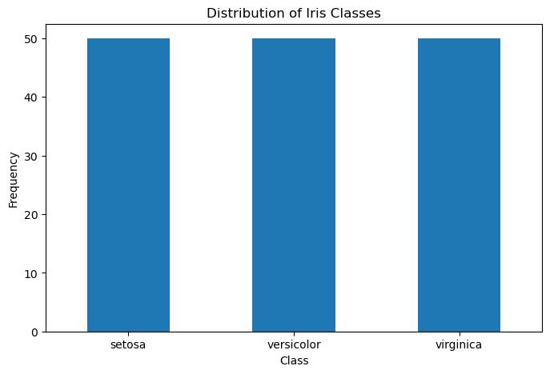
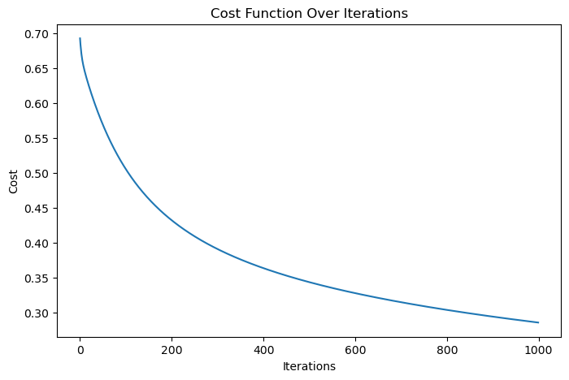
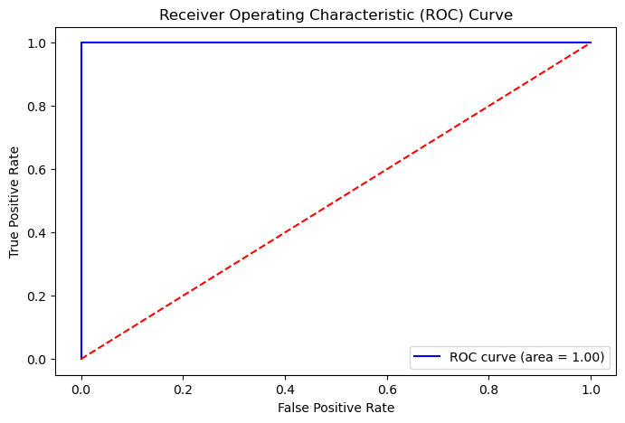

```python
import pandas as pd
from sklearn.datasets import load_iris
 
```


```python
iris = load_iris()
data = pd.DataFrame(data=iris.data, columns=iris.feature_names)
data['target'] = iris.target
 
```


```python
data.head()
```


<div>
<style scoped>
    .dataframe tbody tr th:only-of-type {
        vertical-align: middle;
    }

    .dataframe tbody tr th {
        vertical-align: top;
    }

    .dataframe thead th {
        text-align: right;
    }
</style>
<table border="1" class="dataframe">
  <thead>
    <tr style="text-align: right;">
      <th></th>
      <th>sepal length (cm)</th>
      <th>sepal width (cm)</th>
      <th>petal length (cm)</th>
      <th>petal width (cm)</th>
      <th>target</th>
    </tr>
  </thead>
  <tbody>
    <tr>
      <th>0</th>
      <td>5.1</td>
      <td>3.5</td>
      <td>1.4</td>
      <td>0.2</td>
      <td>0</td>
    </tr>
    <tr>
      <th>1</th>
      <td>4.9</td>
      <td>3.0</td>
      <td>1.4</td>
      <td>0.2</td>
      <td>0</td>
    </tr>
    <tr>
      <th>2</th>
      <td>4.7</td>
      <td>3.2</td>
      <td>1.3</td>
      <td>0.2</td>
      <td>0</td>
    </tr>
    <tr>
      <th>3</th>
      <td>4.6</td>
      <td>3.1</td>
      <td>1.5</td>
      <td>0.2</td>
      <td>0</td>
    </tr>
    <tr>
      <th>4</th>
      <td>5.0</td>
      <td>3.6</td>
      <td>1.4</td>
      <td>0.2</td>
      <td>0</td>
    </tr>
  </tbody>
</table>
</div>


```python
print(data.describe())
 
```

           sepal length (cm)  sepal width (cm)  petal length (cm)  \
    count         150.000000        150.000000         150.000000   
    mean            5.843333          3.057333           3.758000   
    std             0.828066          0.435866           1.765298   
    min             4.300000          2.000000           1.000000   
    25%             5.100000          2.800000           1.600000   
    50%             5.800000          3.000000           4.350000   
    75%             6.400000          3.300000           5.100000   
    max             7.900000          4.400000           6.900000   
    
           petal width (cm)      target  
    count        150.000000  150.000000  
    mean           1.199333    1.000000  
    std            0.762238    0.819232  
    min            0.100000    0.000000  
    25%            0.300000    0.000000  
    50%            1.300000    1.000000  
    75%            1.800000    2.000000  
    max            2.500000    2.000000  


```python
print(data.isnull().sum())
```

    sepal length (cm)    0
    sepal width (cm)     0
    petal length (cm)    0
    petal width (cm)     0
    target               0
    dtype: int64


```python
print(data['target'].value_counts())
```

    target
    0    50
    1    50
    2    50
    Name: count, dtype: int64


```python
import matplotlib.pyplot as plt
 
plt.figure(figsize=(8, 5))
data['target'].value_counts().plot(kind='bar')
plt.xlabel('Class')
plt.ylabel('Frequency')
plt.title('Distribution of Iris Classes')
plt.xticks(ticks=[0, 1, 2], labels=iris.target_names, rotation=0)
plt.show()
```


    

    


```python
data['target'] = (data['target'] == 2).astype(int)
 
print(data['target'].value_counts())
from sklearn.model_selection import train_test_split
 
```

    target
    0    100
    1     50
    Name: count, dtype: int64


```python
X = data.drop('target', axis=1)
y = data['target']
```


```python
X_train, X_test, y_train, y_test = train_test_split(X, y, test_size=0.2, random_state=42)
```


```python
import numpy as np
```


```python
class LogisticRegression:
    def __init__(self, learning_rate=0.01, num_iterations=1000):
        self.learning_rate = learning_rate
        self.num_iterations = num_iterations
        self.weights = None
        self.bias = None
        self.cost_history = []
 
    def sigmoid(self, z):
        return 1 / (1 + np.exp(-z))
 
    def fit(self, X, y):
        num_samples, num_features = X.shape
        self.weights = np.zeros(num_features)
        self.bias = 0
 
        for i in range(self.num_iterations):
            model = np.dot(X, self.weights) + self.bias
            predictions = self.sigmoid(model)
 
            dw = (1 / num_samples) * np.dot(X.T, (predictions - y))
            db = (1 / num_samples) * np.sum(predictions - y)
 
            self.weights -= self.learning_rate * dw
            self.bias -= self.learning_rate * db
 
            cost = - (1 / num_samples) * np.sum(y * np.log(predictions) + (1 - y) * np.log(1 - predictions))
            self.cost_history.append(cost)
 
            if i % 100 == 0:
                print(f"Iteration {i}: Cost {cost}")
 
    def predict(self, X):
        model = np.dot(X, self.weights) + self.bias
        predictions = self.sigmoid(model)
        return predictions >= 0.5
log_reg = LogisticRegression(learning_rate=0.01, num_iterations=1000)

 
log_reg.fit(X_train, y_train)
from sklearn.metrics import accuracy_score, precision_score, recall_score, f1_score
 
y_pred = log_reg.predict(X_test)
accuracy = accuracy_score(y_test, y_pred)
precision = precision_score(y_test, y_pred)
recall = recall_score(y_test, y_pred)
f1 = f1_score(y_test, y_pred)
 
print(f"Accuracy: {accuracy}")
print(f"Precision: {precision}")
print(f"Recall: {recall}")
print(f"F1-Score: {f1}")
plt.figure(figsize=(8, 5))
plt.plot(range(log_reg.num_iterations), log_reg.cost_history)
plt.xlabel('Iterations')
plt.ylabel('Cost')
plt.title('Cost Function Over Iterations')
plt.show()
from sklearn.metrics import roc_curve, auc
 
y_prob = log_reg.sigmoid(np.dot(X_test, log_reg.weights) + log_reg.bias)
 
fpr, tpr, thresholds = roc_curve(y_test, y_prob)
roc_auc = auc(fpr, tpr)
 
plt.figure(figsize=(8, 5))
plt.plot(fpr, tpr, color='blue', label=f'ROC curve (area = {roc_auc:.2f})')
plt.plot([0, 1], [0, 1], color='red', linestyle='--')
plt.xlabel('False Positive Rate')
plt.ylabel('True Positive Rate')
plt.title('Receiver Operating Characteristic (ROC) Curve')
plt.legend(loc="lower right")
plt.show()
 
print(f"AUC-ROC Score: {roc_auc}")
```

    Iteration 0: Cost 0.6931471805599453
    Iteration 100: Cost 0.5054859922629312
    Iteration 200: Cost 0.43224327932175555
    Iteration 300: Cost 0.39096000732923636
    Iteration 400: Cost 0.36362588573562593
    Iteration 500: Cost 0.34355654789164863
    Iteration 600: Cost 0.327784162321562
    Iteration 700: Cost 0.3147995104391504
    Iteration 800: Cost 0.3037528348989142
    Iteration 900: Cost 0.2941268322893424
    Accuracy: 0.9666666666666667
    Precision: 0.9166666666666666
    Recall: 1.0
    F1-Score: 0.9565217391304348


    

    


    

    


    AUC-ROC Score: 1.0


```python

```
