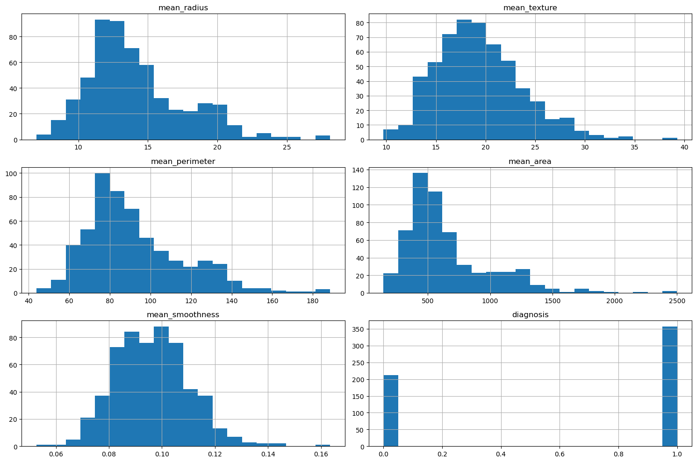
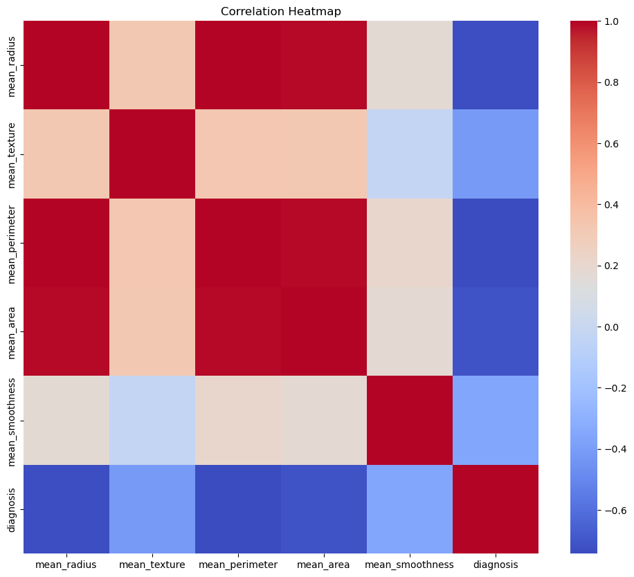
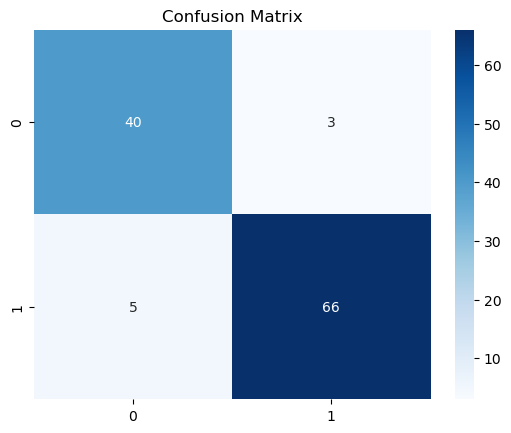
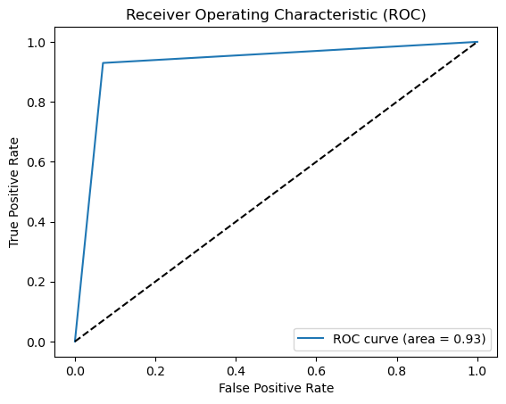

```python
import pandas as pd
import matplotlib.pyplot as plt
import seaborn as sns
import numpy as np
from sklearn.model_selection import train_test_split
from sklearn.metrics import accuracy_score, precision_score, recall_score, confusion_matrix, roc_curve, auc
import matplotlib.pyplot as plt
from sklearn.metrics import roc_curve, auc
```


```python
data = pd.read_csv('/home/anaswara/Downloads/Breast_cancer_data.csv')
```


```python
print(data.info())
print(data.describe())
```

    <class 'pandas.core.frame.DataFrame'>
    RangeIndex: 569 entries, 0 to 568
    Data columns (total 6 columns):
     #   Column           Non-Null Count  Dtype  
    ---  ------           --------------  -----  
     0   mean_radius      569 non-null    float64
     1   mean_texture     569 non-null    float64
     2   mean_perimeter   569 non-null    float64
     3   mean_area        569 non-null    float64
     4   mean_smoothness  569 non-null    float64
     5   diagnosis        569 non-null    int64  
    dtypes: float64(5), int64(1)
    memory usage: 26.8 KB
    None
           mean_radius  mean_texture  mean_perimeter    mean_area  \
    count   569.000000    569.000000      569.000000   569.000000   
    mean     14.127292     19.289649       91.969033   654.889104   
    std       3.524049      4.301036       24.298981   351.914129   
    min       6.981000      9.710000       43.790000   143.500000   
    25%      11.700000     16.170000       75.170000   420.300000   
    50%      13.370000     18.840000       86.240000   551.100000   
    75%      15.780000     21.800000      104.100000   782.700000   
    max      28.110000     39.280000      188.500000  2501.000000   
    
           mean_smoothness   diagnosis  
    count       569.000000  569.000000  
    mean          0.096360    0.627417  
    std           0.014064    0.483918  
    min           0.052630    0.000000  
    25%           0.086370    0.000000  
    50%           0.095870    1.000000  
    75%           0.105300    1.000000  
    max           0.163400    1.000000  


```python
print(data.isnull().sum())
```

    mean_radius        0
    mean_texture       0
    mean_perimeter     0
    mean_area          0
    mean_smoothness    0
    diagnosis          0
    dtype: int64


```python

# Visualizing feature distributions
data.hist(figsize=(15, 10), bins=20)
plt.tight_layout()
plt.show()

```


    

    


```python
plt.figure(figsize=(12, 10))
sns.heatmap(data.corr(), annot=False, cmap='coolwarm')
plt.title("Correlation Heatmap")
plt.show()
```


    

    


```python
class DecisionTree:
    def __init__(self, max_depth=None, min_samples_split=2):  # Corrected the constructor name
        self.max_depth = max_depth
        self.min_samples_split = min_samples_split
        self.tree = None

    def gini_index(self, groups, classes):
        n_instances = sum([len(group) for group in groups])
        gini = 0.0
        for group in groups:
            size = len(group)
            if size == 0:
                continue
            score = 0.0
            for class_val in classes:
                proportion = [row[-1] for row in group].count(class_val) / size
                score += proportion ** 2
            gini += (1 - score) * (size / n_instances)
        return gini

    def split_dataset(self, index, value, dataset):
        left, right = list(), list()
        for row in dataset:
            if row[index] < value:
                left.append(row)
            else:
                right.append(row)
        return left, right

    def get_best_split(self, dataset):
        class_values = list(set(row[-1] for row in dataset))
        b_index, b_value, b_score, b_groups = 999, 999, 999, None
        for index in range(len(dataset[0])-1):
            for row in dataset:
                groups = self.split_dataset(index, row[index], dataset)
                gini = self.gini_index(groups, class_values)
                if gini < b_score:
                    b_index, b_value, b_score, b_groups = index, row[index], gini, groups
        return {'index': b_index, 'value': b_value, 'groups': b_groups}

    def to_terminal(self, group):
        outcomes = [row[-1] for row in group]
        return max(set(outcomes), key=outcomes.count)

    def split(self, node, depth):
        left, right = node['groups']
        del(node['groups'])
        if not left or not right:
            node['left'] = node['right'] = self.to_terminal(left + right)
            return
        if depth >= self.max_depth:
            node['left'], node['right'] = self.to_terminal(left), self.to_terminal(right)
            return
        if len(left) <= self.min_samples_split:
            node['left'] = self.to_terminal(left)
        else:
            node['left'] = self.get_best_split(left)
            self.split(node['left'], depth+1)
        if len(right) <= self.min_samples_split:
            node['right'] = self.to_terminal(right)
        else:
            node['right'] = self.get_best_split(right)
            self.split(node['right'], depth+1)
    def fit(self, X, y):
        dataset = np.column_stack((X, y))
        root = self.get_best_split(dataset)
        self.split(root, 1)
        self.tree = root

    def predict(self, row, node):
        if row[node['index']] < node['value']:
            if isinstance(node['left'], dict):
                return self.predict(row, node['left'])
            else:
                return node['left']
        else:
            if isinstance(node['right'], dict):
                return self.predict(row, node['right'])
            else:
                return node['right']

    def predict_all(self, X):
        return [self.predict(row, self.tree) for row in X]
```


```python
# Splitting the data into training and testing sets
X = data.drop(columns=['diagnosis'])  # Replace 'diagnosis' with the correct column name for labels
y = data['diagnosis'] # Map 'M' to 1 (malignant) and 'B' to 0 (benign)
X_train, X_test, y_train, y_test = train_test_split(X, y, test_size=0.2, random_state=42)

```


```python
# Train the custom Decision Tree
clf = DecisionTree(max_depth=5)
clf.fit(X_train.values, y_train.values)
```


```python
# Predict on the test set
y_pred = clf.predict_all(X_test.values)
```


```python
# Evaluation metrics
accuracy = accuracy_score(y_test, y_pred)
precision = precision_score(y_test, y_pred)
recall = recall_score(y_test, y_pred)

print(f'Accuracy: {accuracy:.2f}')
print(f'Precision: {precision:.2f}')
print(f'Recall: {recall:.2f}')
```

    Accuracy: 0.93
    Precision: 0.96
    Recall: 0.93


```python
# Confusion matrix
cm = confusion_matrix(y_test, y_pred)
print(f'Confusion Matrix:\n{cm}')
```

    Confusion Matrix:
    [[40  3]
     [ 5 66]]


```python
# Confusion matrix visualization
plt.figure()
plt.title('Confusion Matrix')
sns.heatmap(cm, annot=True, fmt="d", cmap="Blues")
plt.show()
```


    

    


```python
# ROC curve and AUC
fpr, tpr, _ = roc_curve(y_test, y_pred)
roc_auc = auc(fpr, tpr)
```


```python
plt.figure()
plt.plot(fpr, tpr, label=f'ROC curve (area = {roc_auc:.2f})')
plt.plot([0, 1], [0, 1], 'k--')  # Diagonal line
plt.xlabel('False Positive Rate')
plt.ylabel('True Positive Rate')
plt.title('Receiver Operating Characteristic (ROC)')
plt.legend(loc="lower right")
plt.show()
```


    

    


```python

```
