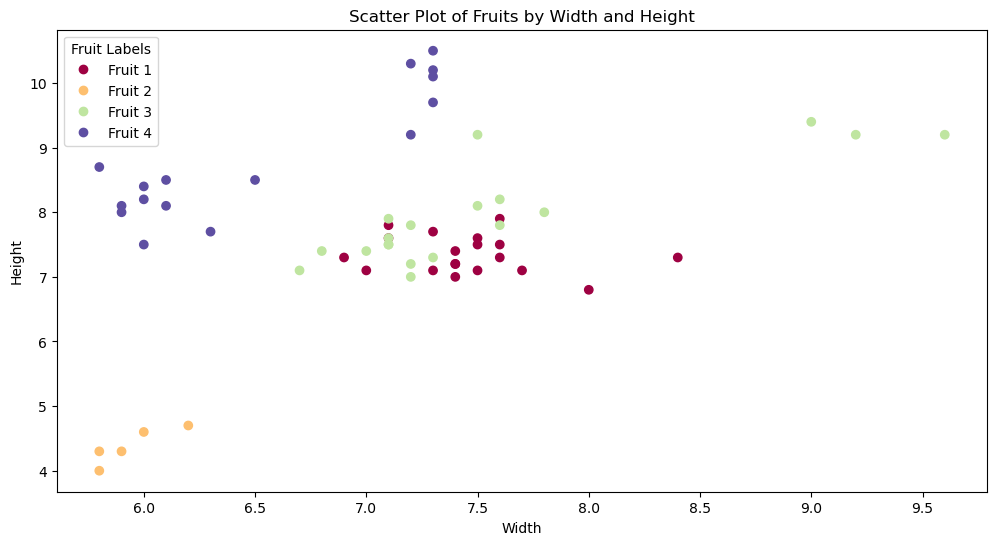

```python
import pandas as pd
import numpy as np
import matplotlib.pyplot as plt
```


```python
df = pd.read_csv("/home/anaswara/Downloads/fruit_data_with_colors.txt", delimiter= '\t') 
df.head()
```


<div>
<style scoped>
    .dataframe tbody tr th:only-of-type {
        vertical-align: middle;
    }

    .dataframe tbody tr th {
        vertical-align: top;
    }

    .dataframe thead th {
        text-align: right;
    }
</style>
<table border="1" class="dataframe">
  <thead>
    <tr style="text-align: right;">
      <th></th>
      <th>fruit_label</th>
      <th>fruit_name</th>
      <th>fruit_subtype</th>
      <th>mass</th>
      <th>width</th>
      <th>height</th>
      <th>color_score</th>
    </tr>
  </thead>
  <tbody>
    <tr>
      <th>0</th>
      <td>1</td>
      <td>apple</td>
      <td>granny_smith</td>
      <td>192</td>
      <td>8.4</td>
      <td>7.3</td>
      <td>0.55</td>
    </tr>
    <tr>
      <th>1</th>
      <td>1</td>
      <td>apple</td>
      <td>granny_smith</td>
      <td>180</td>
      <td>8.0</td>
      <td>6.8</td>
      <td>0.59</td>
    </tr>
    <tr>
      <th>2</th>
      <td>1</td>
      <td>apple</td>
      <td>granny_smith</td>
      <td>176</td>
      <td>7.4</td>
      <td>7.2</td>
      <td>0.60</td>
    </tr>
    <tr>
      <th>3</th>
      <td>2</td>
      <td>mandarin</td>
      <td>mandarin</td>
      <td>86</td>
      <td>6.2</td>
      <td>4.7</td>
      <td>0.80</td>
    </tr>
    <tr>
      <th>4</th>
      <td>2</td>
      <td>mandarin</td>
      <td>mandarin</td>
      <td>84</td>
      <td>6.0</td>
      <td>4.6</td>
      <td>0.79</td>
    </tr>
  </tbody>
</table>
</div>


```python
X = df[['mass', 'height', 'width']]
```


```python
y = df[['fruit_label']]
```


```python
plt.figure(figsize=(12, 6))
scatter = plt.scatter(df['width'], df['height'], c=df['fruit_label'], cmap="Spectral")

# Create a legend
# Create a list of unique fruit labels for the legend
unique_labels = df['fruit_label'].unique()
# Create a list of label names (or you can use any names you prefer)
label_names = [f'Fruit {label}' for label in unique_labels]

# Add the legend to the plot
plt.legend(handles=scatter.legend_elements()[0], labels=label_names, title="Fruit Labels")

# Set plot labels and title
plt.xlabel('Width')
plt.ylabel('Height')
plt.title('Scatter Plot of Fruits by Width and Height')

# Show the plot
plt.show()
```


    

    


```python
def train_test_split(X, y, test_size=0.2, random_state=None):
    # Ensure X and y are numpy arrays
    X = np.array(X)
    y = np.array(y)
    
    # Set random seed for reproducibility
    if random_state is not None:
        np.random.seed(random_state)
    
    # Shuffle indices
    indices = np.arange(X.shape[0])
    np.random.shuffle(indices)
    
    # Split the data
    split_idx = int(X.shape[0] * (1 - test_size))
    train_indices = indices[:split_idx]
    test_indices = indices[split_idx:]
    
    return X[train_indices], X[test_indices], y[train_indices], y[test_indices]

```


```python
X_train, X_test, y_train, y_test = train_test_split(X, y, test_size = 0.2, random_state=1234)
```


```python
X_train = pd.DataFrame(X_train)
X_test = pd.DataFrame(X_test)
y_train = pd.DataFrame(y_train)
y_test = pd.DataFrame(y_test)
```


```python
class K_Nearest_Neighbors_Classifier:
    def __init__(self, K):
        self.K = K

    def fit(self, X_train, Y_train):
        # Convert to numpy arrays for consistency
        self.X_train = np.array(X_train)
        self.Y_train = np.array(Y_train)
        self.m, self.n = self.X_train.shape

    def predict(self, X_test):
        # Convert to numpy arrays for consistency
        self.X_test = np.array(X_test)
        self.m_test, self.n = self.X_test.shape
        Y_predict = np.zeros(self.m_test, dtype=self.Y_train.dtype)

        for i in range(self.m_test):
            x = self.X_test[i]
            neighbors = self.find_neighbors(x)
            # Use mode with a default value to handle potential tie cases
            Y_predict[i] = mode(neighbors, nan_policy='omit').mode[0]
        
        return Y_predict

    def find_neighbors(self, x):
        euclidean_distances = np.zeros(self.m)
        for i in range(self.m):
            d = self.euclidean(x, self.X_train[i])
            euclidean_distances[i] = d
        
        # Get indices of the K smallest distances
        k_indices = np.argsort(euclidean_distances)[:self.K]
        # Return the labels of the K nearest neighbors
        return self.Y_train[k_indices]

    def euclidean(self, x, x_train):
        return np.sqrt(np.sum(np.square(x - x_train)))
```


```python
model = K_Nearest_Neighbors_Classifier(K=5)
model.fit(X_train, y_train)
```


```python
y_pred = model.predict(X_test)
```


```python
y_train_pred = model.predict(X_train)
```


```python
def accuracy_score(y_true, y_pred):
    y_true = np.array(y_true)
    y_pred = np.array(y_pred)
    return np.mean(y_true == y_pred)
```


```python
# Calculate and print the training accuracy.
accuracy_score(y_test, y_pred)
```


    0.3333333333333333


```python
y_test
```


<div>
<style scoped>
    .dataframe tbody tr th:only-of-type {
        vertical-align: middle;
    }

    .dataframe tbody tr th {
        vertical-align: top;
    }

    .dataframe thead th {
        text-align: right;
    }
</style>
<table border="1" class="dataframe">
  <thead>
    <tr style="text-align: right;">
      <th></th>
      <th>0</th>
    </tr>
  </thead>
  <tbody>
    <tr>
      <th>0</th>
      <td>3</td>
    </tr>
    <tr>
      <th>1</th>
      <td>3</td>
    </tr>
    <tr>
      <th>2</th>
      <td>1</td>
    </tr>
    <tr>
      <th>3</th>
      <td>4</td>
    </tr>
    <tr>
      <th>4</th>
      <td>1</td>
    </tr>
    <tr>
      <th>5</th>
      <td>3</td>
    </tr>
    <tr>
      <th>6</th>
      <td>4</td>
    </tr>
    <tr>
      <th>7</th>
      <td>1</td>
    </tr>
    <tr>
      <th>8</th>
      <td>4</td>
    </tr>
    <tr>
      <th>9</th>
      <td>3</td>
    </tr>
    <tr>
      <th>10</th>
      <td>1</td>
    </tr>
    <tr>
      <th>11</th>
      <td>4</td>
    </tr>
  </tbody>
</table>
</div>


```python
y_pred
```


    array([3, 1, 1, 3, 3, 3, 4, 3, 4, 3, 3, 3])


```python
train_accuracy = accuracy_score(y_train,y_train)
test_accuracy = accuracy_score(y_test,y_pred)

```


```python
print(f'Training Accuracy: {train_accuracy:.2f}')
print(f'Test Accuracy: {test_accuracy:.2f}')
```

    Training Accuracy: 1.00
    Test Accuracy: 0.33


```python
new_data = np.array([[150, 6, 7]])
predicted_label = model.predict(new_data)
print(f'Predicted Fruit Label: {predicted_label[0]}')
```

    Predicted Fruit Label: 3


```python

```
