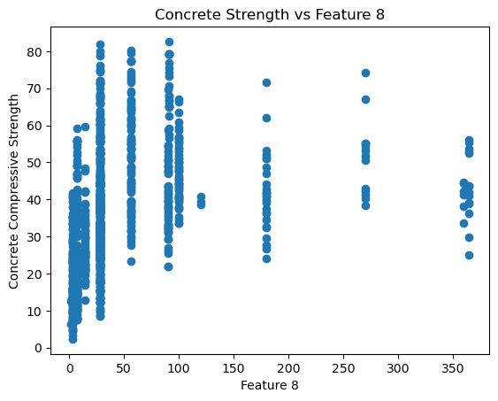
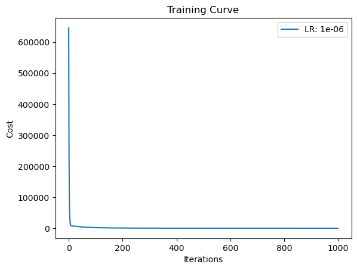

```python
import numpy as np
import pandas as pd
import matplotlib.pyplot as plt
from sklearn.model_selection import train_test_split
from sklearn.preprocessing import StandardScaler
```


```python

data = pd.read_csv('/home/anaswara/Downloads/concrete_data.csv')
```


```python
display(data)
```


<div>
<style scoped>
    .dataframe tbody tr th:only-of-type {
        vertical-align: middle;
    }

    .dataframe tbody tr th {
        vertical-align: top;
    }

    .dataframe thead th {
        text-align: right;
    }
</style>
<table border="1" class="dataframe">
  <thead>
    <tr style="text-align: right;">
      <th></th>
      <th>cement</th>
      <th>blast_furnace_slag</th>
      <th>fly_ash</th>
      <th>water</th>
      <th>superplasticizer</th>
      <th>coarse_aggregate</th>
      <th>fine_aggregate</th>
      <th>age</th>
      <th>concrete_compressive_strength</th>
    </tr>
  </thead>
  <tbody>
    <tr>
      <th>0</th>
      <td>540.0</td>
      <td>0.0</td>
      <td>0.0</td>
      <td>162.0</td>
      <td>2.5</td>
      <td>1040.0</td>
      <td>676.0</td>
      <td>28</td>
      <td>79.99</td>
    </tr>
    <tr>
      <th>1</th>
      <td>540.0</td>
      <td>0.0</td>
      <td>0.0</td>
      <td>162.0</td>
      <td>2.5</td>
      <td>1055.0</td>
      <td>676.0</td>
      <td>28</td>
      <td>61.89</td>
    </tr>
    <tr>
      <th>2</th>
      <td>332.5</td>
      <td>142.5</td>
      <td>0.0</td>
      <td>228.0</td>
      <td>0.0</td>
      <td>932.0</td>
      <td>594.0</td>
      <td>270</td>
      <td>40.27</td>
    </tr>
    <tr>
      <th>3</th>
      <td>332.5</td>
      <td>142.5</td>
      <td>0.0</td>
      <td>228.0</td>
      <td>0.0</td>
      <td>932.0</td>
      <td>594.0</td>
      <td>365</td>
      <td>41.05</td>
    </tr>
    <tr>
      <th>4</th>
      <td>198.6</td>
      <td>132.4</td>
      <td>0.0</td>
      <td>192.0</td>
      <td>0.0</td>
      <td>978.4</td>
      <td>825.5</td>
      <td>360</td>
      <td>44.30</td>
    </tr>
    <tr>
      <th>...</th>
      <td>...</td>
      <td>...</td>
      <td>...</td>
      <td>...</td>
      <td>...</td>
      <td>...</td>
      <td>...</td>
      <td>...</td>
      <td>...</td>
    </tr>
    <tr>
      <th>1025</th>
      <td>276.4</td>
      <td>116.0</td>
      <td>90.3</td>
      <td>179.6</td>
      <td>8.9</td>
      <td>870.1</td>
      <td>768.3</td>
      <td>28</td>
      <td>44.28</td>
    </tr>
    <tr>
      <th>1026</th>
      <td>322.2</td>
      <td>0.0</td>
      <td>115.6</td>
      <td>196.0</td>
      <td>10.4</td>
      <td>817.9</td>
      <td>813.4</td>
      <td>28</td>
      <td>31.18</td>
    </tr>
    <tr>
      <th>1027</th>
      <td>148.5</td>
      <td>139.4</td>
      <td>108.6</td>
      <td>192.7</td>
      <td>6.1</td>
      <td>892.4</td>
      <td>780.0</td>
      <td>28</td>
      <td>23.70</td>
    </tr>
    <tr>
      <th>1028</th>
      <td>159.1</td>
      <td>186.7</td>
      <td>0.0</td>
      <td>175.6</td>
      <td>11.3</td>
      <td>989.6</td>
      <td>788.9</td>
      <td>28</td>
      <td>32.77</td>
    </tr>
    <tr>
      <th>1029</th>
      <td>260.9</td>
      <td>100.5</td>
      <td>78.3</td>
      <td>200.6</td>
      <td>8.6</td>
      <td>864.5</td>
      <td>761.5</td>
      <td>28</td>
      <td>32.40</td>
    </tr>
  </tbody>
</table>
<p>1030 rows × 9 columns</p>
</div>


```python
X = data.iloc[:, :-1].values  # Features
y = data.iloc[:, -1].values
for i in range(X.shape[1]):
    plt.scatter(X[:, i], y)
    plt.xlabel(f'Feature {i+1}')
    plt.ylabel('Concrete Compressive Strength')
    plt.title(f'Concrete Strength vs Feature {i+1}')
    plt.show()
```


    

    


    

    


    

    


    

    


    

    


    

    


    

    


    

    


```python
  def cost_function(X, y, theta):
    m = len(y)
    return (1/(2*m)) * np.sum(np.square(X.dot(theta) - y))


```


```python
def gradient_descent(X, y, theta, learning_rate, iterations):
    m = len(y)
    cost_history = np.zeros(iterations)
    
    for i in range(iterations):
        theta = theta - (learning_rate/m) * (X.T.dot(X.dot(theta) - y))
        cost_history[i] = cost_function(X, y, theta)
    
    return theta, cost_history
    
```


```python
X_b = np.c_[np.ones((X.shape[0], 1)), X]  # Add bias term
theta_initial = np.random.randn(X_b.shape[1])

learning_rates = [0.000001]
iterations = 1000

for lr in learning_rates:
    theta_optimal, cost_history = gradient_descent(X_b, y, theta_initial, lr, iterations)
    plt.plot(range(iterations), cost_history, label=f'LR: {lr}')

plt.xlabel('Iterations')
plt.ylabel('Cost')
plt.title('Training Curve')
plt.legend()
plt.show()
```


    

    


```python
plt.scatter(theta_optimal[1:], np.zeros(len(theta_optimal[1:])), color='red')
plt.xlabel('Weight Vector')
plt.title('Weight Vector Space')
plt.show()
```


    

    


```python
sample_test_cases = np.array([[1, 2, 3, 4, 5, 6, 7, 8]])
sample_test_cases_b = np.c_[np.ones((sample_test_cases.shape[0], 1)), sample_test_cases]
predictions = sample_test_cases_b.dot(theta_optimal)

print("Predicted Concrete Compressive Strength for Test Cases:", predictions)

```

    Predicted Concrete Compressive Strength for Test Cases: [8.86457147]


```python

```
